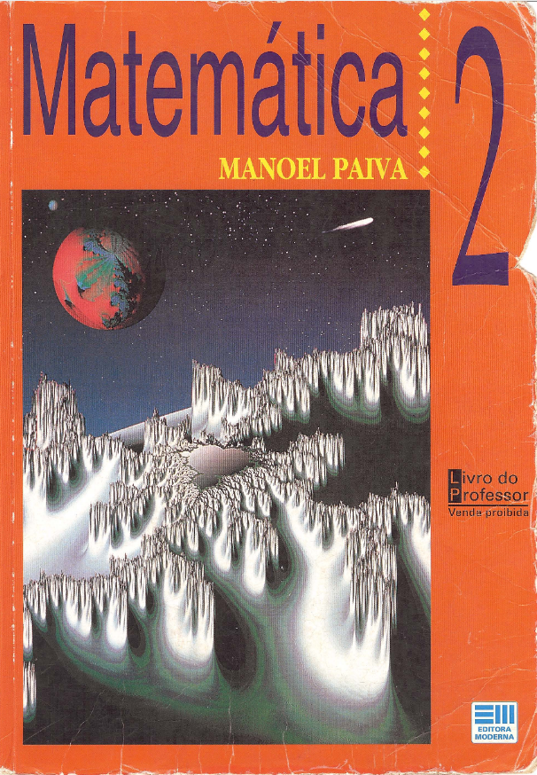

# Probabilidade (Manoel Paiva, Vol 2, 2004)

Neste capítulo estarão contidos os resumos de **Probabilidade** de do livro de Matemática - Volume 2, do autor Manoel Paiva, 1º edição, 2004, da editora Moderna.

```{r echo=FALSE, fig.show="hold", out.width="50%", fig.align = "center", fig.cap="Livro - Matemática Vol 3 - Manoel Paiva, 2004 (Ed. Moderna, 1.ed.)"}

```

|Capítulo|Descrição|
|:--|:--|
| 32 | O conceito de probabilidade |
| 33 | Propriedade da probabilidade |
| 34 | Adição de probabilidade |
| 35 | Probabilidade condicional |
| 36 | Multiplicação de probabilidade |

## Capítulo 21 - Análise combinatória (Métodos de contagem)

### Subseção Numerada 1

Lorem ipsum. Lorem ipsum. Lorem ipsum. Lorem ipsum. Lorem ipsum. Lorem ipsum. Lorem ipsum. Lorem ipsum. Lorem ipsum. Lorem ipsum. Lorem ipsum. Lorem ipsum. Lorem ipsum. Lorem ipsum. Lorem ipsum. Lorem ipsum. Lorem ipsum. Lorem ipsum. Lorem ipsum.

### Exercícios do Capítulo 21

Lorem ipsum. Lorem ipsum. Lorem ipsum. Lorem ipsum. Lorem ipsum. Lorem ipsum. Lorem ipsum. Lorem ipsum. Lorem ipsum. Lorem ipsum. Lorem ipsum. Lorem ipsum. Lorem ipsum. Lorem ipsum. Lorem ipsum. Lorem ipsum. Lorem ipsum. Lorem ipsum. Lorem ipsum.

### Seção não Numerada 3 {-}

Lorem ipsum. Lorem ipsum. Lorem ipsum. Lorem ipsum. Lorem ipsum. Lorem ipsum. Lorem ipsum. Lorem ipsum. Lorem ipsum. Lorem ipsum. Lorem ipsum. Lorem ipsum. Lorem ipsum. Lorem ipsum. Lorem ipsum. Lorem ipsum. Lorem ipsum. Lorem ipsum. Lorem ipsum.
eção 02

## Capítulo 22 - Princípio aditivo da contagem

### Subseção Numerada 1

Lorem ipsum. Lorem ipsum. Lorem ipsum. Lorem ipsum. Lorem ipsum. Lorem ipsum. Lorem ipsum. Lorem ipsum. Lorem ipsum. Lorem ipsum. Lorem ipsum. Lorem ipsum. Lorem ipsum. Lorem ipsum. Lorem ipsum. Lorem ipsum. Lorem ipsum. Lorem ipsum. Lorem ipsum.

### Exercícios do Capítulo 22

Lorem ipsum. Lorem ipsum. Lorem ipsum. Lorem ipsum. Lorem ipsum. Lorem ipsum. Lorem ipsum. Lorem ipsum. Lorem ipsum. Lorem ipsum. Lorem ipsum. Lorem ipsum. Lorem ipsum. Lorem ipsum. Lorem ipsum. Lorem ipsum. Lorem ipsum. Lorem ipsum. Lorem ipsum.

### Seção não Numerada 3 {-}

Lorem ipsum. Lorem ipsum. Lorem ipsum. Lorem ipsum. Lorem ipsum. Lorem ipsum. Lorem ipsum. Lorem ipsum. Lorem ipsum. Lorem ipsum. Lorem ipsum. Lorem ipsum. Lorem ipsum. Lorem ipsum. Lorem ipsum. Lorem ipsum. Lorem ipsum. Lorem ipsum. Lorem ipsum.

## Capítulo 23 - Arranjo simples

### Subseção Numerada 1

Lorem ipsum. Lorem ipsum. Lorem ipsum. Lorem ipsum. Lorem ipsum. Lorem ipsum. Lorem ipsum. Lorem ipsum. Lorem ipsum. Lorem ipsum. Lorem ipsum. Lorem ipsum. Lorem ipsum. Lorem ipsum. Lorem ipsum. Lorem ipsum. Lorem ipsum. Lorem ipsum. Lorem ipsum.

### Exercícios do Capítulo 23

Lorem ipsum. Lorem ipsum. Lorem ipsum. Lorem ipsum. Lorem ipsum. Lorem ipsum. Lorem ipsum. Lorem ipsum. Lorem ipsum. Lorem ipsum. Lorem ipsum. Lorem ipsum. Lorem ipsum. Lorem ipsum. Lorem ipsum. Lorem ipsum. Lorem ipsum. Lorem ipsum. Lorem ipsum.

### Seção não Numerada 3 {-}

Lorem ipsum. Lorem ipsum. Lorem ipsum. Lorem ipsum. Lorem ipsum. Lorem ipsum. Lorem ipsum. Lorem ipsum. Lorem ipsum. Lorem ipsum. Lorem ipsum. Lorem ipsum. Lorem ipsum. Lorem ipsum. Lorem ipsum. Lorem ipsum. Lorem ipsum. Lorem ipsum. Lorem ipsum.
